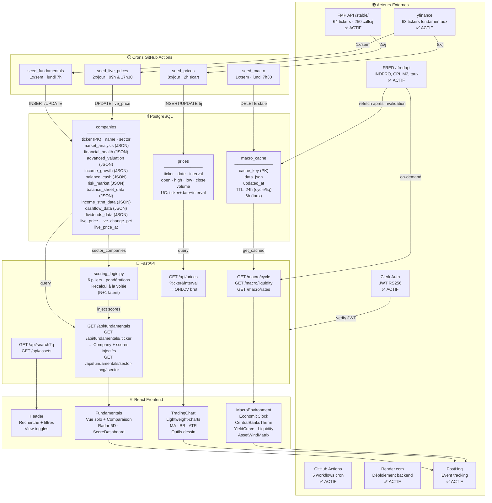

# ARCHITECTURE.md — Audit Boursicot Pro

**Date :** 2026-04-28  
**Auditeur :** Claude Code (Sonnet 4.6)

---

## 1. Stack technique

### Backend
- **Framework :** FastAPI 0.135.3
- **Base de données :** PostgreSQL (via SQLAlchemy 2.0.49)
- **Python :** 3.11
- **Sources de données :**
  - yfinance 1.2.0 (données fondamentales historiques)
  - Financial Modeling Prep (FMP) API `/stable/` (prix live via cron — 250 calls/jour gratuit)
  - FRED (Federal Reserve Economic Data) via fredapi 0.5.1 (indicateurs macroéconomiques)
- **Auth :** Clerk (JWT RS256 validation)
- **Orchestration :** GitHub Actions (5 workflows cron)

### Frontend
- **Framework :** React 19.2.4
- **Build/Dev :** Vite 8.0.8
- **Charting :** Lightweight-charts 5.1.0 (OHLCV + indicateurs techniques)
- **UI :** Lucide-react 1.7.0 (icônes)
- **Auth :** Clerk React 5.61.5
- **Analytics :** PostHog 1.372.1 (event tracking)
- **Routing :** React Router DOM 7.14.1
- **Tests :** React Testing Library 16.3.2 (présent, peu utilisé)

### Déploiement
- Backend : Render.com (Python app)
- Frontend : Render.com / Vercel (static site)

---

## 2. Architecture générale

### Flux de données de bout en bout

```
┌──────────────────────────────────────────────────────────────────┐
│                 ACQUISITION (GitHub Actions Crons)               │
│                                                                   │
│  yfinance             FMP /stable/             FRED/fredapi      │
│  ├─ seed_fundamentals (1x/sem lundi)                             │
│  │  → Bilans, ratios, 4 ans historiques, dividendes              │
│  │                                                               │
│  ├─ seed_prices (8x/jour, 2h écart)                              │
│  │  → OHLCV 15m/1h/1D/1W — 5 jours glissants                    │
│  │                                                               │
│  ├─ seed_live_prices (2x/jour: 09h, 17h30)    → 64 tickers      │
│  │  → close_price + daily_change_pct → stocké en DB              │
│  │                                                               │
│  └─ seed_macro (1x/sem lundi 7h30)            → FRED on-demand  │
│     → Invalide macro_cache → force refetch FRED                  │
└──────────────────────────────────────────────────────────────────┘
                             ↓
          ┌──────────────────────────────────┐
          │        PostgreSQL                │
          │  • companies  (63 rows)          │
          │  • prices     (~800k rows)       │
          │  • macro_cache (TTL 24h/6h)      │
          └──────────────────────────────────┘
                             ↓
          ┌──────────────────────────────────┐
          │        FastAPI Backend           │
          │  /api/fundamentals/{ticker}      │
          │  /api/prices?ticker&interval     │
          │  /macro/{cycle,rates,liquidity}  │
          │  /api/search  /api/assets        │
          │  + scoring_logic.py (à la volée) │
          └──────────────────────────────────┘
                             ↓
          ┌──────────────────────────────────┐
          │      React Frontend              │
          │  TradingChart (Lightweight)      │
          │  Fundamentals + Scores           │
          │  MacroEnvironment                │
          │  Comparaison multi-actifs        │
          └──────────────────────────────────┘
                             ↓
                       PostHog Analytics
```

### Calcul des scores (à la volée, côté API)
- **Input :** Company + sector_companies (même secteur)
- **6 piliers :** Health (25%) · Valuation (20%) · Growth (20%) · Efficiency (15%) · Dividend (10%) · Momentum (10%)
- **Verdict :** Excellent (≥7.5) · Bon (≥6) · Correct (≥4.5) · Risqué (≥3) · À éviter
- **Complexité :** Marché Cap + Beta → indicateur du niveau d'investisseur requis

---

## 3. Organisation du code

### 3.1 Backend

| Fichier | Rôle |
|---------|------|
| `api.py` | Point d'entrée FastAPI. Setup CORS, auth globale (Clerk guest/token) |
| `models.py` | 3 modèles SQLAlchemy : Company, Price, MacroCache |
| `database.py` | Connexion PostgreSQL + SessionLocal |
| `dependencies.py` | JWT validation Clerk — guest fallback si token absent/expiré |
| `scoring_logic.py` | 6 fonctions de score + pondération — recalcul à chaque requête |
| `assets_config.py` | Source unique : 64 tickers (ASSET_DICTIONARY + TICKERS list) |
| `seed_utils.py` | Parseurs yfinance (DataFrame→JSON), maps de traduction EN→FR |
| `routers/prices.py` | GET /api/prices — OHLCV par ticker + intervalle |
| `routers/fundamentals.py` | GET /api/fundamentals/{ticker} — Company + scores + sector-averages |
| `routers/search.py` | GET /api/search?q — ILIKE sur ticker/name |
| `routers/assets.py` | GET /api/assets — Catalogue complet |
| `routers/macro.py` | GET /macro/{cycle,rates,liquidity} — délègue à macro_service |
| `services/macro_service.py` | Fetch FRED/yfinance, calcul phase (4×4 Growth/Inflation), normalisation M2/BTC |
| `services/cache_service.py` | get_cached (TTL), get_stale (fallback), set_cached |
| `seeds/seed_fundamentals.py` | yfinance → companies table (1x/semaine) |
| `seeds/seed_prices.py` | yfinance → prices table, 5 jours glissants (8x/jour) |
| `seeds/seed_prices_init.py` | Chargement initial 10 ans — exécution manuelle unique |
| `seeds/seed_live_prices.py` | FMP → companies.live_price (2x/jour) via FMP_TICKER_MAP |
| `seeds/seed_macro.py` | Invalide macro_cache (1x/semaine) |
| `.github/workflows/` | 5 crons : fundamentals (lun), prices (8x/j), live_prices (2x/j), macro (lun) |

### 3.2 Frontend

| Fichier | Rôle |
|---------|------|
| `main.jsx` | Clerk provider + theme context + PostHog init |
| `App.jsx` | Router racine — dashboard protégé (chart / fundamentals / macro) |
| `Header.jsx` | Recherche filtrée (type/pays/secteur), view toggles, Clerk UserButton |
| `TradingChart.jsx` | Lightweight-charts OHLC + MA10/100/200, BB, ATR, Volume + outils dessin |
| `SimpleChart.jsx` | Lightweight-charts simplifié pour comparaisons |
| `Fundamentals.jsx` | Vue solo (métriques, scores, états financiers) + comparaison (tables, radar 6D) |
| `fundamentals/ScoreDashboard.jsx` | 6 jauges + note globale + verdict + complexité + modale méthodologie |
| `fundamentals/MetricCard.jsx` | 1 métrique : val vs secteur, delta % |
| `fundamentals/MetricInfo.jsx` | Tooltip pédagogique 2 niveaux (C'est quoi / Pourquoi c'est important) |
| `fundamentals/MethodologyModal.jsx` | Modal explicatif de la méthodologie de scoring |
| `MacroEnvironment.jsx` | Agrège EconomicClock + CentralBanksThermometer + YieldCurve + Liquidity + AssetWindMatrix |
| `EconomicClock.jsx` | Jauge 4-phase + historique INDPRO/CPI (1948–2025, ~920 pts) coloré par phase |
| `AssetWindMatrix.jsx` | Matrice phase→actifs (Fidelity/Ray Dalio) avec explications dépliables |
| `CentralBanksThermometer.jsx` | Fed, BCE, BoE, BoJ — taux directeurs + historique |
| `YieldCurveChart.jsx` | Courbe des taux US + historique T10Y2Y |
| `SovereignSpreadsChart.jsx` | Spreads OAT/Bund/Gilt vs US |
| `LiquidityMonitor.jsx` | M2 vs BTC normalisés (base 100, depuis jan 2020) |
| `hooks/useFundamentals.js` | Promise.all sur N symboles → {dataMap, loading, errors} |
| `hooks/usePrices.js` | GET /api/prices → rawData + calcul indicators (MA, BB, ATR) côté client |
| `hooks/useMacro.js` | useRetryFetch → {cycleData, cycleHistory, liquidityData} |
| `hooks/useRetryFetch.js` | Retry exponentiel (5s base, max 4 tentatives) |
| `constants/metricExplanations.js` | 43 métriques → {what: "...", why: "..."} (tooltips pédagogiques) |
| `constants/pillars.js` | Définitions des 6 piliers de score |

---

## 4. Points forts

1. **Architecture modulaire :** Backend/frontend décorrélés, services isolés, middlewares propres.
2. **Caching intelligent :** PostgreSQL macro_cache avec TTL granulaire (24h défaut, 6h taux).
3. **Fallback robuste :** `get_stale()` en cas d'indisponibilité FRED → continuité de service.
4. **Sourcing multi-fournisseur :** yfinance (fondamentaux) + FMP (live prices) + FRED (macro).
5. **Scoring contextuel :** Calcul à la volée avec comparaison sectorielle, 6 piliers pondérés.
6. **UI éducative :** Tooltips 2 niveaux, modale méthodologie, cycle Fidelity/Dalio, matrice actifs.
7. **Indicateurs techniques avancés :** BB, ATR, MA10/100/200, outils de dessin dans TradingChart.
8. **Auth dégradée :** Guest fallback → pas de blocage en cas d'erreur Clerk.
9. **Macro sophistiquée :** Cycle 4×4, courbe des taux, spreads souverains, liquidité M2/BTC normalisée.
10. **Crons GitHub Actions :** Orchestration asynchrone gratuite, indépendante du backend Render.

---

## 5. Faiblesses et dette technique

### Critiques

1. **Scoring N+1 latent :** GET /fundamentals/{ticker} charge toutes les companies du secteur à chaque requête, sans cache — recalcul à chaque hit.

2. **Scoring inutilisable pour indices/crypto :** Les indices (^GSPC) et commodités n'ont pas de données fondamentales yfinance → scores à 5.0 par défaut.

3. **Budget FMP à risque :** 128 calls/jour sur 250 (51%). Aucune vérification du quota avant exécution. Pas de fallback si FMP sature.

4. **Absence totale de tests :** Aucun unittest backend (models, scoring, cache). Aucun test d'intégration seeding + API. Testing Library présent frontend mais non utilisé.

5. **Données OHLCV fragmentées :** Seulement 5 jours glissants en continu. Initialisation complète (10 ans) requiert exécution manuelle. Pas de vérification des gaps.

6. **Scoring désynchronisé du live :** Le momentum utilise les ratios stockés (Prix Actuel, MM50/200 en JSON) qui ne sont pas mis à jour par seed_live_prices → drift progressif.

7. **yfinance instable :** Pas de retry/timeout robuste dans seed_fundamentals.py. Tickers multi-devises sans normalisation → ratios distordus (PER Hermès en EUR vs Apple en USD).

8. **DB sans index secondaire :** Table prices (~800k lignes) sans index optimisé → scans complets prévisibles après 2 ans.

9. **BoJ hardcodé :** Taux directeur Banque du Japon figé à jan 2025 dans CentralBanksThermometer.

### Couplages fragiles

- `seed_live_prices.py` ↔ `assets_config.py` : FMP_TICKER_MAP hardcodé, pas de fallback si symbole FMP change.
- `scoring_logic.py` ↔ `models.py` : Structure JSON (6 blocs) dépendante de champs nommés en dur.
- `TradingChart.jsx` : Indicateurs recalculés côté client à chaque fetch (MA naïf O(n²)).

---

## 6. Risques

### 6.1 Sécurité

| Risque | Sévérité | Détail |
|--------|----------|--------|
| JWT sans audience | Faible | `verify_aud=False` → guest fallback permissif (acceptable MVP) |
| Pas de rate limiting API | Moyen | Aucune protection contre appels massifs côté frontend |
| Search ILIKE non sanitisé | Faible | SQLAlchemy immunise l'injection SQL mais pas de validation longueur/regex |
| Secrets Render | OK | FMP_API_KEY, FRED_API_KEY, SQLALCHEMY_DATABASE_URL via Render secrets |

### 6.2 Fiabilité

| Risque | Impact | Mitigation actuelle |
|--------|--------|---------------------|
| Render cold start | UX — 30s premier chargement | Banneau "bêta" |
| yfinance timeout | Seed incomplet | `time.sleep(0.5)` naïf |
| FRED indisponible | Macro vide | `get_stale()` fallback |
| PostgreSQL downtime | API crash total | Aucun retry SessionLocal |
| Macro history >10s | Latence perçue | Cache 24h limite les hits |

### 6.3 Budget API

| Source | Limite | Utilisation | Marge |
|--------|--------|-------------|-------|
| FMP | 250 calls/jour | 128/jour (2 crons) | 49% — épuisé si tests manuels |
| FRED | Gratuit illimité | ~3 req/cache miss | Large |
| yfinance | Gratuit (scraping) | 63 tickers × 1x/semaine | Fragile (anti-scraping) |
| Clerk | 1k users gratuit | ~10 req/session | Large |

---

## 7. Schéma d'architecture des données



### Fréquences de refresh

| Données | Fréquence | Source | Table |
|---------|-----------|--------|-------|
| Fondamentaux (ratios, bilans) | 1x/semaine | yfinance | companies |
| OHLCV historique (5j glissants) | 8x/jour | yfinance | prices |
| Prix live + variation | 2x/jour | FMP | companies.live_price |
| Macro (cycle, liquidité, taux) | On-demand + cache 24/6h | FRED | macro_cache |
| Invalidation cache macro | 1x/semaine | Cron manuel | macro_cache |

---

## 8. Décisions techniques notables

### FMP vs yFinance pour prix live
yfinance scrape Yahoo Finance avec un délai de 15+ min et une instabilité croissante (anti-scraping). FMP offre live prices <1 min via une API structurée. Trade-off : 250 calls/jour gratuits — couvert pour 64 tickers × 2 runs (128/250).

### Seed vs temps réel
Render gratuit ne supporte pas des calculs temps réel intensifs (cold starts, RAM limitée). Les crons GitHub Actions exécutent les seeds de façon asynchrone sans charger le backend API. Les 800k lignes OHLCV et 63 fundamentals sont mieux chargés en batch.

### Scoring à la volée vs pré-calculé
Les scores dépendent d'une comparaison sectorielle dynamique — impossible à pré-calculer sans connaître la requête. Alternative (materialized view) rejetée faute de tests. N+1 latent acceptable à faible trafic.

### Lightweight-charts vs TradingView Widget
Open source, pas de paywall, ~500kb gzipped, customisation complète (outils dessin custom). Downside : pas de support officiel, calculs d'indicateurs déportés côté client.

### Clerk vs Auth0
SDK React natif, Render-friendly, gratuit jusqu'à 1k users. Guest fallback (verify_aud=False) pour ne pas bloquer les utilisateurs anonymes en cas de timeout Clerk.

### PostgreSQL JSON columns
Flexibilité sans migration pour faire évoluer la structure des 6 blocs métriques. Transactionnalité pour le cache macro. Requêtes relationnelles pour les moyennes sectorielles.

### FRED pour macro
Données officielles Fed, historique depuis 1947, gratuit et stable. yfinance moins fiable pour séries longues (INDPRO, CPI mensuel).

---

## 9. Roadmap suggérée (5 actions prioritaires)

| Priorité | Action | Effort | Impact |
|----------|--------|--------|--------|
| 1 | **Index DB** — `CREATE INDEX idx_prices(ticker, date, interval)` | 0.5 jour | 10–50× perf requêtes prices |
| 2 | **Cache scores** — column `scores_json` + pré-calcul lundi post-seed | 1 jour | Élimine N+1, −50% latency /fundamentals |
| 3 | **Tests intégration** — pytest (seed + endpoints + macro fallback) | 2 jours | Confiance déploiement, détection régression |
| 4 | **Monitoring FMP quota** — logger calls, alert si >85% budget/jour | 1.5 jours | Prévention dépassement quota |
| 5 | **Normalisation multi-devise** — EUR/USD par ticker avant scoring | 3 jours | Scores comparables CAC40 vs Mag7 |

---

## 10. Opportunités d'amélioration

### Quick wins (< 1 jour)
- Index PostgreSQL sur `prices(ticker, date, interval)` et `companies(sector)`
- Retry exponentiel dans `seed_fundamentals.py` (3x, 2s base, timeout 15s)
- Logging count appels FMP + alerte si >200 calls/jour
- Export CSV depuis la vue Fundamentals

### Améliorations moyennes (1–5 jours)
- Cache scores hebdo (column `scores_json` + `scores_updated_at` — 2 jours)
- Tests intégration backend pytest avec CI GitHub (2 jours)
- Fallback yfinance si FMP indisponible — mode dégradé 503 (1.5 jour)
- Mise à jour automatique BoJ dans CentralBanksThermometer (0.5 jour)
- Lazy-loading routes React (Vite `manualChunks`) pour LCP (1 jour)

### Chantiers structurants (> 5 jours)
- Normalisation multi-devise (EUR/USD/GBP/JPY) pour scoring global cohérent (5 jours)
- Enrichissement macro : credit spreads HY/IG, REITs, Atlanta Fed GDPNow (4 jours)
- Moteur de backtesting : portefeuille mécanique basé sur verdicts vs benchmark (10 jours)
- Score trend (évolution YoY de chaque pilier + détection inflexion) (3 jours)
- Application mobile React Native avec push notifications (15 jours)
